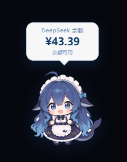

# dsh-whale-pet 🐋

DeepSeek Harness 鲸鱼娘余额桌宠 —— 作为固定插件常驻在 dsh Web GUI 右下角:一只鲸鱼娘,头顶气泡实时显示 DeepSeek 剩余余额。

## 功能

- **右下角常驻鲸鱼娘 + 余额气泡**:余额每 60 秒自动刷新,点击鲸鱼娘可手动刷新
- **双击打开用量页**:双击鲸鱼娘在新标签页打开 [DeepSeek 用量页](https://platform.deepseek.com/usage)
- **可拖动 + 位置记忆**:按住鲸鱼娘即可拖动摆放;位置自动记忆在浏览器 `localStorage`,下次打开自动还原(若移出视口则回到右下角默认位置)
- **密钥安全**:余额查询走 Host 端路由,API Key 只存在于 Harness 凭据服务,浏览器不接触任何密钥

## 效果预览



> 鲸鱼娘形象 + 余额气泡(图中 ¥43.39 为真实余额);单击刷新,双击打开用量页,按住拖动摆放。

## 目录结构

```
dsh-whale-pet/
├── package.json              # 仓库根包声明(供 git 安装:dsh.bundle.patch + dsh.client + files)
├── plugin/                   # 插件源码(手动复制安装时的包源)
│   ├── index.js              # Host 端:/__whale-pet/balance 余额、/__whale-pet/image 形象图
│   ├── client.js             # 浏览器端:桌宠 UI(bundle 无需构建)
│   ├── cordis.patch.yml      # bundle 补丁层(插入插件行)
│   └── package.json          # plugin/ 形态的包声明
├── assets/                   # 素材库(形象原图、预览图、素材清单)
├── preview.png               # README 效果预览截图
├── whale_pet.png             # 当前使用的鲸鱼娘形象
├── whale_pet_b64.txt         # 形象图 base64(Host 端从插件包内读取)
└── 启动说明.md                # 原始安装笔记(中文)
```

## 安装

本插件是 dsh 的 **out-of-tree bundle**。形象图路径在 `index.js` 里**随插件包自身解析**(优先 `plugin/` 上一级的 `whale_pet_b64.txt`,兼容仅复制 `plugin/` 时与 `index.js` 同目录),所以两种安装形态都不需要改代码。

### 方式一:从 GitHub 直接安装(推荐)

```sh
dsh plugin --profile web add github:Yelloooooow/dsh-whale-pet
```

`dsh plugin` 会把仓库作为插件包安装到 profile,并因包声明了 `dsh.bundle.patch` 而**自动加入 `dsh.profile.bundles`**。`whale_pet_b64.txt` 随包分发。装完重启 Harness、刷新页面即出现鲸鱼娘。

### 方式二:手动复制 `plugin/`

把 `plugin/` 的四个文件放入 `C:\Users\<you>\.dsh\profiles\web\node_modules\dsh-whale-pet\`,并**把 `whale_pet_b64.txt` 也复制进同一目录**(形象图随包读取)。确认 profile 的 `package.json` 中 `dsh.profile.bundles` 含 `"dsh-whale-pet"`,然后重启 Harness。

### 依赖的服务

插件使用 dsh web 组合自带的能力:Host 端需要 `webServer`、`credentials`(解析 `DEEPSEEK_API_KEY`)、`subprocess`;浏览器端需要 `slots` 服务(挂到 `shell.overlay` 槽)。均无需额外安装。

## 数据接口(Host 端 webServer 路由)

- `GET /__whale-pet/balance` — DeepSeek 余额(凭据服务解析 API Key,curl → node fetch 双通道,保证可用性)
- `GET /__whale-pet/image` — 鲸鱼娘形象图 data URI

## 自定义形象

1. 替换 `whale_pet.png`
2. 重新生成 base64 到 `whale_pet_b64.txt`:
   - PowerShell:`[Convert]::ToBase64String([IO.File]::ReadAllBytes("$PWD\whale_pet.png")) > whale_pet_b64.txt`
   - Git Bash:`base64 -w0 whale_pet.png > whale_pet_b64.txt`
3. 同步 `plugin/` 与 `whale_pet_b64.txt` 到 profile(`index.js` 会从包内找到它,无需改路径),重启 Harness 生效

## 许可与署名

- **代码**:MIT License,见 [LICENSE](LICENSE)
- **形象素材**:基于 [fornarwhal/deepseek-whale-girl-icon](https://github.com/fornarwhal/deepseek-whale-girl-icon)(CC BY-NC-SA 4.0)的二创作品,按 **CC BY-NC-SA 4.0** 分发
  - 角色原型:上善无形 OC「溟月」
  - DeepSeek 元素二创:ZipZipPipe(GPT Image 2)
  - 许可证全文:https://creativecommons.org/licenses/by-nc-sa/4.0/
